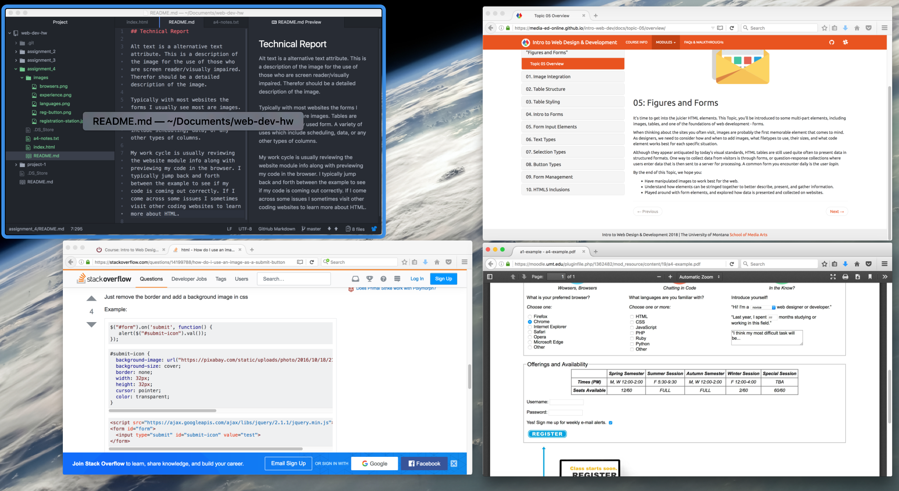

## Technical Report

Alt text is a alternative text attribute. This is a description of the image for the use of those who are screen reader/visually impaired. Therefor should be a detailed description of the image.

Typically with most websites the forms I usually see most are images. Tables are another commonly used form. A variety of uses which include scheduling, data, or any other types of columns.

My work cycle is usually reviewing the website module info along with previewing my code in the browser. I typically jump back and forth between the example to see if my code is coming out correctly. If I come across some issues I sometimes visit other coding websites to learn more about HTML.

