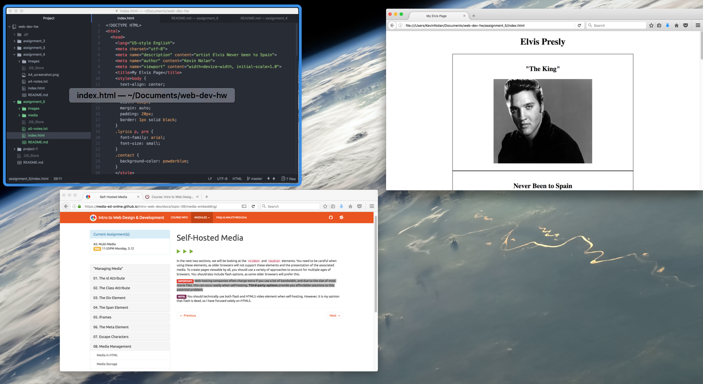

## Technical Report

An ID is a unique identifier for specific elements. For example, the ID element should be different from every other element's ID on the page.

Div elements are used to block other elements together.The Div element is used to increase structural clarity and identify element groups.

Spans element can exist within divs, and do not create blocks. They serve to identify or group content together that requires organization or extra styling. You can have multiple span elements inside a Div.

The class attribute is an identifier and selector value for HTML elements. The class attribute groups similar types of elements together by using the same unique name value.

Web hosting companies can charge extra if you use a lot of bandwidth, this can occur easily when self-hosting. Third-party options provide you with a free solution!

My work cycle pretty much revolved around reading through the materials on the website and previewing other peoples work. I also utilized to github board and solved some issues!

