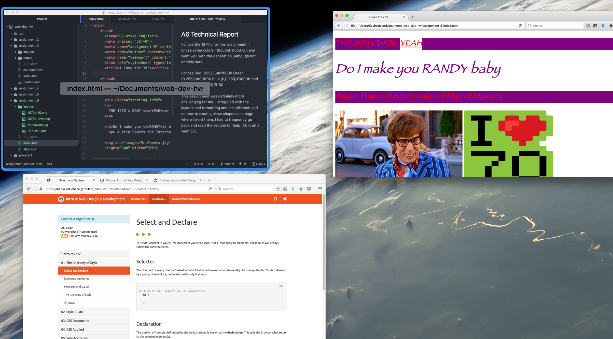

## A6 Technical Report

I chose the 1970's for this assignment. I chose some colors I thought stood out and went well with the generation, although not entirely sure.

I chose Red (255,0,0)#ff0000 Green (0,255,0)#00ff00
Blue (0,0,255)#0000ff and Yellow (255,255,0)ffff00

This assignment was definitely more challenging for me. I struggled with the layouts and formatting and am still confused on how to exactly place shapes on a page where I want them. I had to frequently go back and read the section for help. All in all it went OK.

