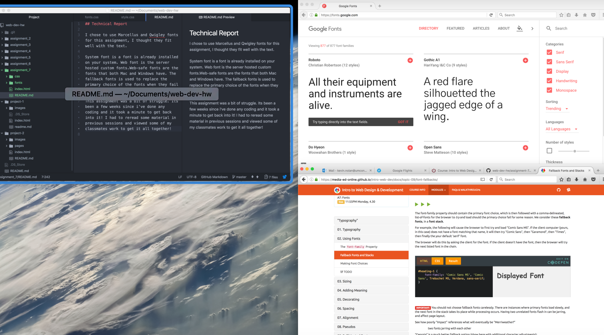

## Technical Report

I chose to use Marcellus and Qwigley fonts for this assignment, I thought they fit well with the text.

System font is a font is already installed on your system. Web font is the server hosted custom fonts.Web-safe fonts are the fonts that both Mac and Windows have. The fallback fonts is used to replace the primary choice of the fonts when they fail to work.

This assignment was a bit of struggle. Its been a few weeks since i've done any coding and it took a minute to get back into it! I had to reread some material in previous sessions and viewed some of my classmates work to get it all together!

