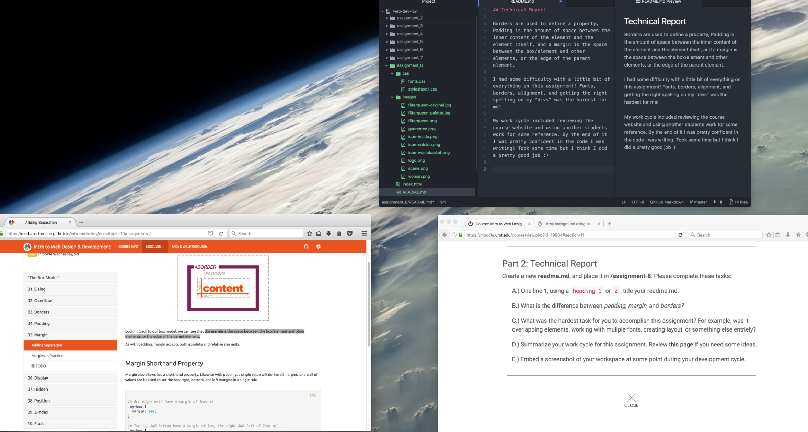

## Technical Report

Borders are used to define a property, Padding is the amount of space between the inner content of the element and the element itself, and a margin is the space between the box/element and other elements, or the edge of the parent element.

I had some difficulty with a little bit of everything on this assignment! Fonts, borders, alignment, and getting the right spelling on my "divs" was the hardest for me!

My work cycle included reviewing the course website and using another students work for some reference. By the end of it I was pretty confident in the code I was writing! Took some time but I think I did a pretty good job :)

